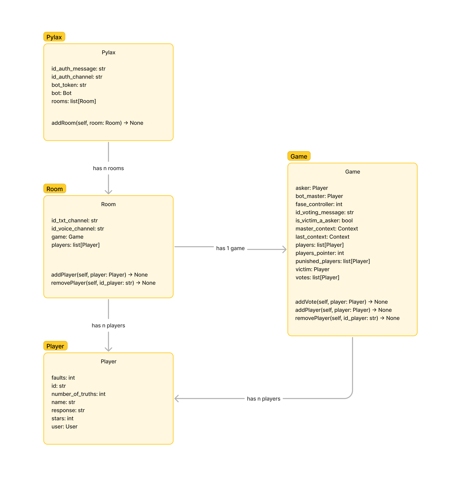

# Contributing
Pylax is an [Open Source](https://en.wikipedia.org/wiki/Open_source) project, which means that anyone can contribute to the project. If you want to contribute to the project, please read the contribution script below.

- [ ] Do a fork of the project.
- [ ] Check if your fork is updated with the latest version of the project.
- [ ] Check if there is not already an open issue for your contribution. If there is, comment on the issue to indicate that you will do it or not.
- [ ] Do  the necessary changes.
- [ ] Do a pull request to the project.

## Object relationships

## Relationships in the game
